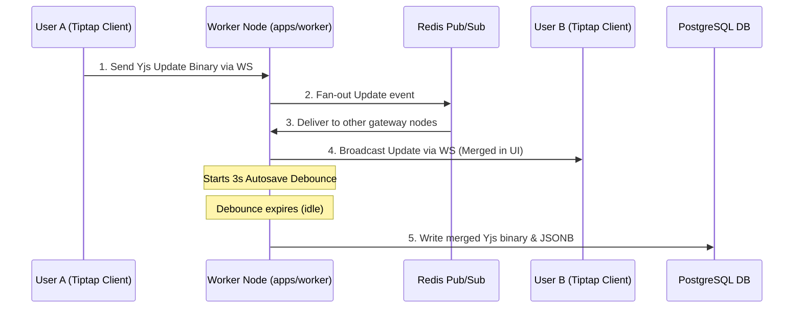

# 🔄 Data Flow & API Conventions

This document details the data exchange pathways in Pikzee, including HTTP REST client-server calls, real-time WebSocket syncing, and database storage strategies.

---

## 1. Request-Response Lifecycle (HTTP REST)

For standard CRUD operations (Workspaces, Projects, and Members):

```
Client (Next.js)
  ──[ 1. HTTP Request + JWT Bearer ]──>
    Nginx Reverse Proxy
      ──[ 2. Route Matching ]──>
        NestJS API (apps/api)
          ──[ 3. ClerkAuthGuard ]──>
            Database (Drizzle ORM)
```

1.  **Authentication:** Every request to protected API routes must include the Clerk JWT in the `Authorization` header: `Bearer <clerk-jwt>`.
2.  **Validation:** Requests are validated at the NestJS entry controller using `nestjs-zod` pipes and shared Zod schemas from `@pikzee/shared-types`.
3.  **ORM Layer:** NestJS services use Drizzle ORM to perform queries and transactions against PostgreSQL.
4.  **Response Models:** All JSON payloads are returned in a standard API envelope:
    ```json
    {
      "success": true,
      "data": { ... }
    }
    ```

---

## 2. Real-Time Sync Lifecycle (Yjs & WebSockets)

Document updates bypass the stateless HTTP API and flow through a dedicated WebSockets pipeline:



1.  **Keystroke:** A user typing inside TipTap generates a Yjs update delta (compressed binary array).
2.  **WebSocket Transit:** The update is transmitted over WebSockets to the Hocuspocus server hosted in `apps/worker`.
3.  **In-Memory Merge:** The worker merges the update instantly in its active CRDT memory tree.
4.  **Fanning Out:** The worker broadcasts the delta to all other users connected to the document. To scale across multiple server nodes, updates are synchronized via **Redis Pub/Sub**.
5.  **Debounced Persistence:** The worker runs a 3-second debounced background task. If no updates occur during this window, the worker encodes the unified document and executes a write to PostgreSQL.

---

## 3. Direct-to-S3 Upload Data Flow

Large asset uploads offload file streaming from the application server directly to the storage bucket:

```
1. Client  ──[ Get Pre-signed PUT/Multipart URLs ]──> NestJS API
2. Client  <──[ Return Secure Upload URLs & S3 Key ]── NestJS API
3. Client  ──[ Stream File Payload Chunks ]──> AWS S3 Storage
4. Client  ──[ POST /assets/upload/complete ]──> NestJS API (Saves metadata to DB)
```
