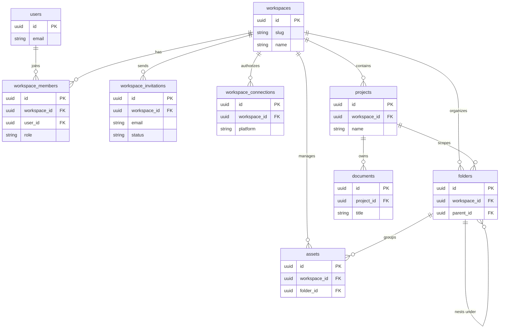

# 🗄️ Database Architecture

This document describes the database design principles, entity relationships, performance standards, and security guardrails governing the Pikzee persistence layer.

---

## 1. Overview

Pikzee uses **PostgreSQL** as its primary relational database.

- **Why PostgreSQL?** It is a production-grade, highly reliable relational database that natively supports advanced data types like `JSONB` (essential for storing TipTap document trees), `BYTEA` (for Yjs binary CRDT buffers), and fast indexing structures (`btree`, `gin`). It provides the strict ACID compliance necessary for transactional operations like billing, project provisioning, and workspace memberships.

---

## 2. Database Technology Stack

- **Primary Database:** PostgreSQL 16+
- **Object-Relational Mapper (ORM):** **Drizzle ORM** (Typescript-first, lightweight, compile-time type-safe queries, zero runtime overhead).
- **Migration Engine:** Drizzle Kit
- **Cache & Pub/Sub:** Redis (for session cache, BullMQ queues, and WebSocket pub/sub).

---

## 3. Design Principles

All schemas and database operations must adhere to these four core design principles:

1.  **UUID Everywhere:** Never use auto-incrementing integer IDs (`serial` or `bigserial`) for primary keys. All tables must use randomly generated UUID v4 keys. This prevents ID guessing attacks, facilitates seamless horizontal scaling, and allows offline clients to generate IDs safely.
2.  **Never Expose Internal IDs:** Database primary keys (UUIDs) are kept secure. Public URLs and API responses utilize separate, client-safe identifier columns (e.g., `slug`, `publicId`).
3.  **No Polymorphic Tables:** Avoid polymorphic relationships (where a single foreign key column can link to multiple different tables depending on a "type" string). Instead, use explicit join tables or nullable columns to enforce foreign key integrity at the database engine level.
4.  **Soft Delete Important Records:** High-value data (e.g., workspaces, projects, assets, documents) must never be hard-deleted on initial request. Instead, they utilize a `deleted_at` timestamp or a `status` field set to `'archived'`. This facilitates data recovery and compliance.

---

## 4. High-Level Entity-Relationship (ER) Diagram

The following diagram illustrates the relational layout of the core domain models:

---

## 5. Domain Models (Aggregates)

- **Workspace Aggregate:** Consists of `workspaces`, `workspace_members`, and `workspace_invitations`. Represents the isolated security and billing boundary.
- **Asset Catalog Aggregate:** Consists of `folders` and `assets`. Handles folder hierarchies and direct-to-S3 file uploads.
- **Document Canvas Aggregate:** Consists of `documents` and version snapshots. Manages TipTap JSON structures and Yjs CRDT edit sequences.

---

## 6. Relationships & Cardinality

- **User $\rightarrow$ Workspace (Many-to-Many via `workspace_members`):** A user can belong to multiple workspaces, and a workspace has multiple members. Explicit join table keeps roles (OWNER, EDITOR) strictly scoped to a single workspace.
- **Workspace $\rightarrow$ Project (One-to-Many):** A workspace owns multiple projects. All projects are deleted if the parent workspace is archived.
- **Project $\rightarrow$ Document (One-to-Many):** A project contains multiple edit canvasses (documents).
- **Folder $\rightarrow$ Folder (One-to-Many, Self-Referencing):** A folder can have multiple sub-folders. The `parent_id` foreign key points back to the `folders.id` column. A null `parent_id` denotes a root folder.

---

## 7. Multi-Tenancy Design

Pikzee implements **Logical Isolation** at the application and schema level.

- Every tenant-scoped table (e.g., `projects`, `assets`, `folders`, `documents`) **must** contain a `workspace_id` column.
- All backend database queries must join or filter by the current `workspace_id` resolved from the request headers/JWT context.
- We do not use physical multi-tenancy (separate databases per tenant) because logical partitioning offers simpler scaling and indexing.

---

## 8. Indexing Strategy

To guarantee rapid query execution times as the database scales, we enforce specific indexes:

| Table               | Index Columns             | Index Type       | Purpose                                                       |
| :------------------ | :------------------------ | :--------------- | :------------------------------------------------------------ |
| `workspace_members` | `workspace_id, user_id`   | Composite B-Tree | High-speed membership validation and security role lookups.   |
| `folders`           | `workspace_id, parent_id` | Composite B-Tree | Instant tree navigation when rendering subfolders.            |
| `assets`            | `workspace_id, folder_id` | Composite B-Tree | Instant file navigation inside folders.                       |
| `documents`         | `project_id`              | B-Tree           | Speeds up loading list views of documents inside projects.    |
| `documents`         | `content_text`            | GIN (Full Text)  | Supports instant search matches across raw document contents. |

---

## 9. Transaction Isolation

We enforce database transactions (`db.transaction()`) for all multi-step mutations to maintain database integrity:

- **Workspace Provisioning:** Creating a workspace, adding the owner user to `workspace_members`, and initializing the root folders must succeed or fail together.
- **Invitation Acceptance:** Verifying the token, creating the workspace member record, and marking the invitation as `ACCEPTED` must run atomically.
- **Batch Operations:** Moving or deleting multiple files/folders together must be executed inside a transaction.

---

## 10. Audit Trail

- All tables must include `created_at` and `updated_at` timestamps.
- Destructive updates (such as soft-deletions) must record who initiated the command using a `deleted_by` column.

---

## 11. Schema Migrations

- **Engine:** Drizzle Kit manages all schema generation and migration tracking.
- **Flow:**
  1.  Developers modify `.schema.ts` files inside `libs/shared/db`.
  2.  Run `pnpm db:generate` to generate SQL delta scripts.
  3.  Review migration files before committing.
  4.  Run `pnpm db:migrate` on deployment to apply pending SQL scripts.

---

## 12. Naming Conventions

- **Tables:** Plural and `snake_case` (e.g., `workspace_members`, `workspace_connections`).
- **Columns:** Singular and `snake_case` (e.g., `access_token`, `expires_at`).
- **Foreign Keys:** Suffix with `_id` (e.g., `workspace_id`).
- **Indexes:** Named explicitly as `<table_name>_<columns>_idx` (e.g., `folders_workspace_parent_idx`).

---

## 13. Performance Guidelines

- **Avoid N+1 Queries:** Never make database calls inside a loop. Use SQL joins or load relationships in single batch queries using `IN` conditions.
- **Cursor Pagination:** Use cursor-based pagination (e.g. mapping `created_at` + `id`) instead of offset-based pagination (`LIMIT / OFFSET`) for large tables like `assets`.
- **Never Load Large Trees:** When navigating assets, only fetch the immediate child nodes of the active folder. Never load the entire recursive tree into memory.

---

## 14. Security Guardrails

- **Workspace Scoping:** All queries inside controllers/services must validate that the request context matches the targeted `workspace_id`.
- **Role Validation:** Before executing mutation requests (write, update, delete), queries must assert that the user role matches the permissions defined in the RBAC matrix.
