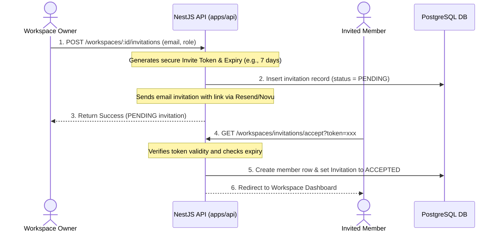

# ✉️ Workspace Invitations

To add new members to a workspace, the system uses a secure email-based invitation flow.

---

## 1. Invitation Lifecycle Flow

---

## 2. Key Backend Safeguards

- **Signature Verification:** Invitation tokens are encrypted/signed with a workspace secret key.
- **Expiration Validation:** Invites automatically expire after 7 days. If a user clicks an expired link, the backend rejects it and marks the invitation record as `EXPIRED`.
- **Target Email Locking:** Only the user registered under the invited email address can accept the invitation, preventing unauthorized token sharing.
