# User Lifecycle Flow

This guide details the complete flow of a brand new user signing up, passing through the webhook sync, completing onboarding, and redirecting to their workspace dashboard.

```mermaid
sequenceDiagram
    autonumber
    actor User
    participant Web as Next.js Web (Frontend)
    participant Clerk as Clerk (Auth Provider)
    participant API as NestJS API (Backend)
    participant DB as PostgreSQL DB

    User->>Web: 1. Sign-Up Form Input
    Web->>Clerk: 2. Create User Request
    Clerk-->>User: 3. Sends OTP Verification Email
    User->>Web: 4. Enter OTP Code
    Web->>Clerk: 5. Verify & Complete Sign-Up

    rect rgb(20, 30, 45)
        Note over Clerk, DB: Asynchronous Webhook Sync
        Clerk-->>API: 6. Webhook POST /webhooks/clerk (user.created)
        API->>DB: 7. Insert new user record
    end

    Web->>Web: 8. Redirect to /onboarding
    Web->>API: 9. GET /workspace/mine (Membership check)
    API-->>Web: 10. Returns empty array []
    Web->>User: 11. Render Onboarding Wizard

    User->>Web: 12. Input Workspace name & Finish onboarding
    Web->>API: 13. POST /workspace (Create Workspace)
    API->>DB: 14. Create Workspace & WorkspaceMember records
    API-->>Web: 15. Returns Workspace data

    Web->>User: 16. Redirect to /[workspaceSlug]/dashboard
```

---

## 1. Sign-Up & Account Creation

1. **User Registration**:
   The user signs up on the frontend landing page (`/?show-signup=true`). The custom sign-up form triggers Clerk's registration method:
   `signUp.create({ emailAddress, password, ... })`.
2. **Email Verification**:
   Clerk emails a verification One-Time Password (OTP) to the user's address. The user submits the code in the verification modal, calling:
   `signUp.verifications.verifyEmailCode({ code })`.
3. **Session Finalization**:
   Once verified, the frontend finalizes the session via `signUp.finalize()` and directs the user to `/onboarding`.

---

## 2. Asynchronous User Sync (Webhook)

- **Production**:
  Clerk immediately dispatches a secure `user.created` event payload to the NestJS API endpoint:
  `POST /api/webhooks/clerk`.
  The API validates the webhook signature using `svix`, parses the fields, and inserts the user into the local PostgreSQL database:
  `usersService.createFromClerk({ clerkId, email, firstName, lastName, avatarImage })`.
- **Local Development Fallback**:
  If local webhooks are not configured via a public tunnel (ngrok), the NestJS `ClerkGuard` intercepts the user's first API call. It queries Clerk's API using the SDK to fetch user profile details, inserting them dynamically (auto-sync).

---

## 3. Onboarding Redirect & Authorization Checks

1. The browser navigates to `/onboarding`.
2. The server-side page guard runs:
   - Fetches the user's workspaces from the NestJS API: `GET /workspace/mine`.
   - Since this is a new user, the response is empty (`[]`).
3. The server renders the fullscreen **Onboarding Wizard** wizard:
   - **Step 1: Account Created**: Welcome landing splash.
   - **Step 2: Workspace Setup**: The user specifies their Workspace name. A preview URL slug is auto-generated.
   - **Step 3: Invite Members (Optional)**: Form to add email addresses of collaborators.

---

## 4. Workspace Creation & Dashboard Entry

1. The user clicks **Finish** or **Skip** on the onboarding wizard.
2. The frontend triggers `POST /api/workspace` with the workspace name and slug.
3. The NestJS API:
   - Creates the workspace record in PostgreSQL.
   - Automatically designates the creating user as the **Owner** of the workspace inside `workspace_members`.
4. The API returns the created workspace object.
5. The frontend redirects the browser to the dynamic dashboard:
   `/[workspaceSlug]/dashboard`.

---

## 5. Subsequent Accesses

- When the logged-in user visits the app in the future, the `/dashboard` route behaves as an **intelligent router**:
  - It fetches `/workspace/mine`.
  - It detects the existing workspace membership and immediately forwards the user to their workspace dashboard (e.g. `/my-workspace/dashboard`), completely bypassing the onboarding stepper.
