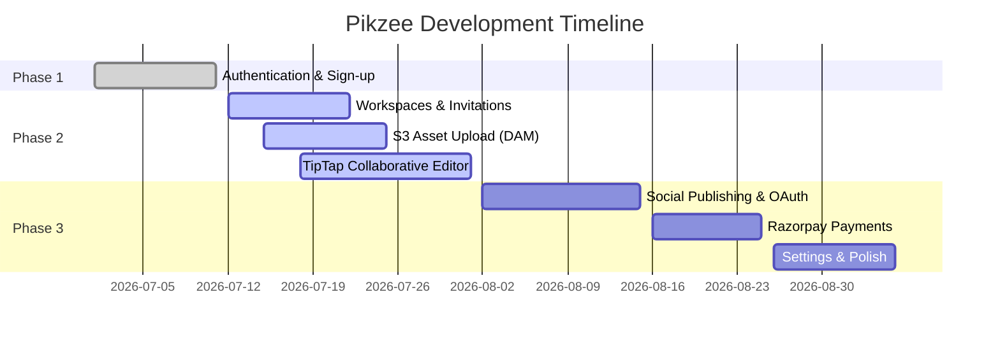

# 📍 Roadmap & Development Phases

This page maps out the current development phases of the Pikzee project, tracking backend and frontend completeness.

---

## Current Roadmap Phase: **Phase 2 - Workspaces, DAM & Document Editor**

We are currently focusing on finishing Workspace permissions, direct-to-S3 asset uploads, and integrating the collaborative rich-text TipTap editor.

---

## 📋 Feature Implementation Status

## Feature 1: Authentication (100% Completed)

- **Completed Tasks:**
  - [x] **Clerk Webhook Synchronization**:
    - [x] Register public webhook endpoint `POST /webhooks/clerk` inside NestJS (`apps/api`).
    - [x] Verify incoming Clerk payload signatures using `svix` and `CLERK_WEBHOOK_SECRET`.
    - [x] Process `user.created` events to populate user records in local PostgreSQL DB.
    - [x] Process `user.updated` and `user.deleted` events to keep user tables in sync.
  - [x] **Clerk JWT Authentication Guard**:
    - [x] Create NestJS `ClerkAuthGuard` to verify request Authorization header JWTs.
    - [x] Create custom `@CurrentUser()` decorator to inject verified user records into controllers.
  - [x] **Sign-In Flow & Interface**:
    - [x] Build custom Sign-In form UI utilizing modular components from `@pikzee/ui`.
    - [x] Hook up form validation via `zodResolver` using schemas from `@pikzee/shared-types`.
    - [x] Implement authentication request using Clerk Core 3.0 `signIn.password()` strategy.
    - [x] Finalize user session and cookie configuration via `signIn.finalize()` and redirect.
  - [x] **Sign-Up Flow & Interface**:
    - [x] Build custom Sign-Up form UI overlay.
    - [x] Bind form validation state to `react-hook-form` and validation schemas.
    - [x] Implement user registration initialization using Clerk's `signUp.create()` method.
  - [x] **Onboarding Wizard widget**:
    - [x] Build a multi-step onboarding wizard overlay for first-time users.
    - [x] Implement initial workspace and project creation steps inside the onboarding wizard.
    - [x] Enforce user redirection to `/onboarding` if they do not belong to any workspace.
  - [x] **Protected Routes & Redirection Rules**:
    - [x] Configure public vs protected route matchers in Next.js `middleware.ts`.
    - [x] Setup auth layout guards in `(dashboard)` layout.
    - [x] Handle redirect logic to prevent loops when signed-in users hit `/sign-in` or anonymous users hit dashboard routes.
  - [x] **Email OTP Verification UI**:
    - [x] Build custom 6-digit OTP code verification modal/screen for pending registrations.
    - [x] Connect the input handler to submit verification via `signUp.attemptEmailAddressVerification({ code })`.
  - [x] **Password Reset (Forgot Password) Flow**:
    - [x] Build a custom Forgot Password view (email input to request reset).
    - [x] Implement password reset token request dispatch using Clerk SDK.
    - [x] Create Forgot Password code verification & new password input UI.
    - [x] Submit verification and finalize password reset flow.
  - [x] **Terms & Privacy Consent**:
    - [x] Render required legal policy consent checkboxes inside the custom Sign-Up Dialog.
    - [x] Link checkboxes to static legal policy routes.

---

## Feature 2: Workspace & Members Management

- **Completed Tasks:**
  - [x] **Workspace CRUD & Switcher**:
    - [x] Create, update, and retrieve workspaces in the backend (`workspace` module).
    - [x] Implement workspace switcher and creation UI on the frontend.
- **Outstanding Tasks:**
  - [ ] **Workspace Member Management**:
    - [ ] Implement backend logic for retrieving workspace members and managing roles (`members` module).
    - [ ] Build workspace members list and role/member management dialogs in the frontend.
  - [ ] **Workspace Invitation Flow**:
    - [ ] Implement backend invitation lifecycle including sending, accepting, and invalidating/expiring invites.
    - [ ] Build frontend invitation forms, accept-invite page, and pending invitation tracking UI.
  - [ ] **Role-Based Permissions & Authorization**:
    - [ ] Define backend permissions mapped to workspace roles (OWNER, EDITOR, COMMENTOR, GUEST).
    - [ ] Create NestJS authorization guard/decorators (e.g., `@RequirePermissions`) to secure API endpoints.
    - [ ] Implement frontend client-side route/action guards and conditional UI component rendering based on user role/permissions.

---

## Feature 3: Project Management

- **Completed Tasks:**
  - [x] **Project Cards & Creation UI**:
    - [x] Create project cards and project creation UI in the frontend.
- **Outstanding Tasks:**
  - [ ] **Project Backend Core & Schema**:
    - [ ] Create a NestJS `project` module.
    - [ ] Define the `projects` table schema using Drizzle ORM.
    - [ ] Implement API endpoints for CRUD operations on projects.
  - [ ] **Project Navigation & API Integration**:
    - [ ] Build the project dashboard view with a sidebar for folder navigation.
    - [ ] Connect frontend UI to the project API endpoints.
  - [ ] **Project Access Control & Security**:
    - [ ] Implement project-level access control rules and backend authorization guards.

---

## Feature 4: Asset Management

- **Completed Tasks:**
  - [x] **Asset Display & Selection UI**:
    - [x] Create UI for displaying folders and assets (cards and list views).
    - [x] Implement frontend single and multi-select functionality for files/folders.
- **Outstanding Tasks:**
  - [ ] **Asset Backend Core & Schema**:
    - [ ] Create a NestJS `asset` module for managing files and folders.
    - [ ] Define the `assets` table database schema.
    - [ ] Implement API endpoints for CRUD operations on individual assets.
  - [ ] **Batch Operations & API Integration**:
    - [ ] Implement backend APIs for batch actions (move, copy, delete).
    - [ ] Connect frontend asset management screens to the backend asset APIs.

---

## Feature 5: Upload Management

- **Completed Tasks:**
  - [x] **Client-Side Upload Interface**:
    - [x] Implement a file upload dropzone component.
    - [x] Implement frontend chunked uploading logic for handling large files.
- **Outstanding Tasks:**
  - [ ] **S3 Client Service Setup (`@pikzee/assets`)**:
    - [ ] Configure global AWS SDK S3 client provider using workspace environment variables.
    - [ ] Design S3 key naming conventions (`workspaces/[id]/assets/[uuid]`).
  - [ ] **Pre-signed URL Generator**:
    - [ ] Create NestJS `upload` module endpoints.
    - [ ] Implement Single PUT pre-signed URL generation for small files (<10MB).
    - [ ] Implement Multipart Upload Initialization endpoints returning `UploadId` and chunked upload URLs.
  - [ ] **Upload Completion & Asset DB Sync**:
    - [ ] Implement `POST /assets/upload/complete` to verify uploaded parts, finalize S3 multipart merges, and insert the asset record into the database.
    - [ ] Connect the frontend dropzone to call pre-signed URL APIs, execute upload requests to S3, and trigger finalization.

---

## Feature 6: Document & Drafts Management

- **Completed Tasks:**
  - [x] **Rich Text Editor Integration**:
    - [x] Integrate the Tiptap editor component (block feature).
- **Outstanding Tasks:**
  - [ ] **Premium TipTap Customizations (`@pikzee/documents`)**:
    - [ ] Build custom Notion-style `/` slash commands menu (headings, lists, code, callouts).
    - [ ] Create floating bubble menu overlay for text formatting.
    - [ ] Implement custom callout blocks (with emoji/banner settings) and syntax-highlighted code blocks (using lowlight).
    - [ ] Build drag-and-drop file/image node upload indicator and inline rendering.
  - [ ] **Real-Time Collab Gateway (`apps/worker` & `@pikzee/collab`)**:
    - [ ] Implement Hocuspocus WebSocket gateway as a stateful NestJS service in `apps/worker`.
    - [ ] Configure Redis Pub/Sub adapter to sync cursor positions/avatars across worker instances.
    - [ ] Add client-side collaboration hooks for cursor awareness.
  - [ ] **Debounced DB Persistence & Storage**:
    - [ ] Design document table schema with `yjs_state` (binary/BYTEA), `content_json` (JSONB), and `content_text` (indexed text for full-text search).
    - [ ] Implement debounced (3s idle) and throttled (10s max) document autosave tasks on the Hocuspocus server.

---

## Feature 7: Asset Upload to Social Platforms

- **Completed Tasks:**
  - [x] **Social Uploader UI**:
    - [x] Build the user interface for social publishing.
- **Outstanding Tasks:**
  - [ ] **Unified Connection Schema & Strategy Pattern**:
    - [ ] Define the `workspace_connections` table schema for storing encrypted OAuth tokens.
    - [ ] Build strategy pattern interfaces to dynamically handle OAuth and publishing operations by platform.
  - [ ] **Platform OAuth 2.0 Integrations**:
    - [ ] Implement Google/YouTube OAuth (ensuring `access_type=offline` and `prompt=consent` for refresh token retrieval).
    - [ ] Implement LinkedIn OAuth 2.0 (scopes `w_member_social`, `w_organization_social`).
    - [ ] Implement Twitter/X OAuth 2.0 with PKCE (storing verifiers/challenges in Redis).
  - [ ] **Async Queue Publishing & Token Refresh**:
    - [ ] Configure background worker cron jobs in `apps/worker` to refresh social tokens before expiration.
    - [ ] Set up BullMQ worker consumers to stream media files from S3 to platform upload APIs and update database publishing statuses.

---

## Feature 8: Payment

- **Completed Tasks:**
  - _None_
- **Outstanding Tasks:**
  - [ ] **Razorpay Integration**:
    - [ ] Create NestJS `payment` module.
    - [ ] Integrate Razorpay SDK on the backend.
    - [ ] Implement backend APIs for creating and verifying transaction details/payments.
  - [ ] **Billing & Payment Flows**:
    - [ ] Create a billing / payment settings UI.
    - [ ] Implement checkout and payment flows in the frontend.

---

## Feature 9: Settings

- **Completed Tasks:**
  - [x] **Settings Panels UI**:
    - [x] Create frontend UI panels for user, workspace, and project configurations.
- **Outstanding Tasks:**
  - [ ] **Settings API & Integration**:
    - [ ] Create NestJS `settings` module.
    - [ ] Implement backend endpoints for retrieving and saving user, workspace, and project configuration settings.
    - [ ] Connect frontend settings forms to settings APIs.
